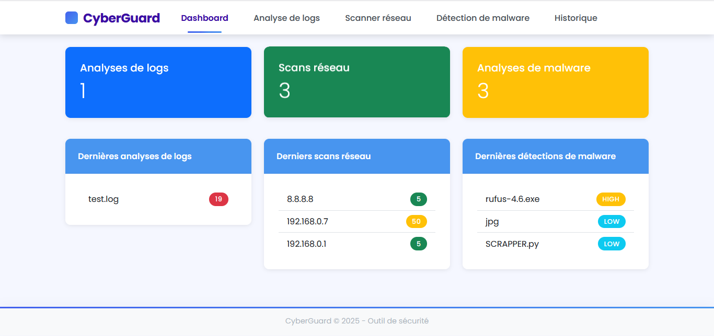

# 🛡️ CyberGuard – Gardien de la Cybersécurité Tout-en-Un

**CyberGuard** est une application **Flask** développée par **ADEGBETI Christian**, conçue pour effectuer des analyses de sécurité locales sur :
- 📝 des **fichiers de logs**
- 🌐 des **adresses IP réseau**
- 🦠 des **fichiers potentiellement malveillants**

Une solution simple, éducative, tout-en-un, **100% hors ligne**.

---

## 🎯 Objectifs

- Aider les **étudiants**, **enseignants** et **petites structures** à évaluer la sécurité de leurs systèmes
- Offrir une interface **unifiée et intuitive** regroupant 3 fonctions clés de sécurité
- Permettre une analyse **rapide, locale et confidentielle**, sans besoin d'internet

---

## 🚀 Fonctionnalités

### 🔍 Analyse de fichiers de logs
- Détection de : brute force, SQL injection, XSS, traversée de répertoires, bots automatisés
- Résumé des menaces par type
- Aperçu ligne par ligne des tentatives suspectes

### 🌐 Scan réseau (IP)
- Détection de **ports ouverts** (21, 22, 80, 443, etc.)
- Analyse de services vulnérables (FTP, Telnet, RDP…)
- Attribution d’un **score de risque**

### 🦠 Détection de malwares
- Vérification des extensions malveillantes
- Signature binaire (PE, ELF, ZIP…)
- Analyse de chaînes dangereuses (`eval`, `cmd.exe`, `base64_decode`, etc.)
- Classification : **LOW**, **MEDIUM**, **HIGH**, **CRITICAL**

### 📊 Dashboard d’historique
- Historique consolidé des analyses (logs, réseau, fichiers)
- Visualisation des rapports récents

---

## 🖥️ Interface utilisateur



- `index.html` : tableau de bord général
- `log_analyzer.html` : analyse des logs
- `network_scanner.html` : scan réseau
- `malware_detector.html` : scan de fichiers suspects

---

## ⚙️ Installation

```bash
# 1. Cloner le dépôt
git clone https://github.com/christianADE/Cyberguard.git
cd Cyberguard

# 2. Installer les dépendances
pip install -r requirements.txt

# 3. Lancer l'application Flask
python app.py
````

🖥️ Lancer l’application : [http://127.0.0.1:5000](http://127.0.0.1:5000)

---

## 📦 Dépendances

Voir [`requirements.txt`](./requirements.txt)

---

## 👨‍💻 Auteur

* 👤 **ADEGBETI Christian**
* 📧 [christianadegbeti@gmail.com](mailto:christianadegbeti@gmail.com)
* 🌐 [Portfolio](https://achristian.netlify.app)

---

> 🔐 **CyberGuard** est un projet développé à des fins **éducatives et défensives**. Toute utilisation offensive ou illégale est strictement interdite.

```
